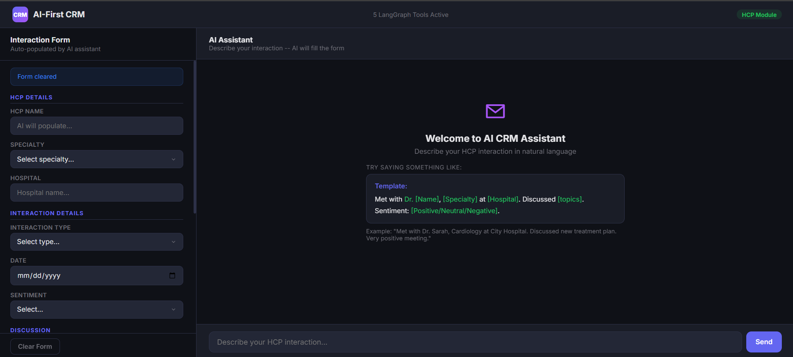
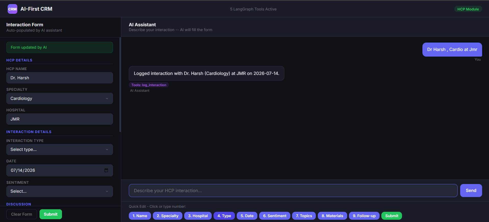
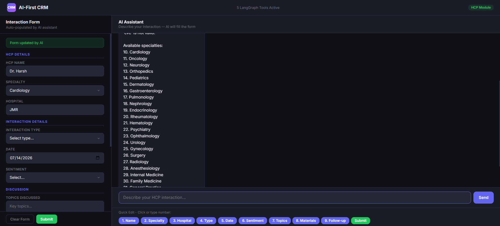

# Medical-Crm
# AI-First CRM - HCP Module

An AI-powered CRM system for healthcare professional (HCP) interaction management, driven by natural language chat using LangGraph, FastAPI, and Groq LLM.

## Live Demo





<video src="Showcasing_With_Explanation.mp4" width="100%" controls>
  Your browser does not support the video tag.
</video>
## Overview

This project implements an AI-first CRM module that allows sales representatives to log, edit, search, and summarize HCP interactions using natural language. The system uses a LangGraph-based agent with five specialized tools to handle all CRM operations through conversational AI.

---

## LangGraph AI Agent & Tools

### Role of the LangGraph Agent

The LangGraph agent serves as the **central intelligence** of the CRM system. It:

- **Processes natural language input** from sales representatives
- **Decides which tool(s)** to invoke based on user intent
- **Manages conversation state** across multiple interactions
- **Extracts entities** (HCP names, hospitals, specialties, dates, sentiment) from unstructured text
- **Coordinates tool execution** and formats responses
- **Maintains form state** so edits can be applied to the current interaction

The agent uses a **state graph** with two nodes:
1. **Agent Node** — LLM decides which tool to call based on the user's message
2. **Tools Node** — Executes the selected tool and returns results

Flow: `User Input → Agent → (Tool?) → Tools → Agent → Response`

---

### Five LangGraph Tools

#### 1. Log Interaction Tool

**Purpose:** Captures HCP interaction data from natural language descriptions.

**How it works:**
- Uses the LLM to **extract entities** from free-text input:
  - HCP name (auto-prefixes "Dr." if missing)
  - Specialty (cardiology, oncology, etc.)
  - Hospital/clinic name
  - Interaction type (meeting, visit, phone call, etc.)
  - Date (handles relative dates like "yesterday", "last week")
  - Sentiment (positive, neutral, negative)
  - Topics discussed
  - Materials shared
  - Follow-up actions
- **Summarizes** the interaction for the notes field
- Returns structured form data to auto-populate the UI

**Example:**
```
User: "Met Dr. Sarah Chen at Metro Heart Institute yesterday, discussed new cardiology treatment plan, very positive meeting"
→ Extracts: name=Dr. Sarah Chen, hospital=Metro Heart Institute, specialty=Cardiology, 
  type=Meeting, date=2026-07-13, sentiment=Positive, topics=cardiology treatment plan
```

#### 2. Edit Interaction Tool

**Purpose:** Modifies specific fields in the currently logged interaction.

**How it works:**
- Accepts `field_name` and `new_value` parameters
- Supports **flexible field identification**:
  - Numbers: "1" = hcp_name, "2" = specialty, etc.
  - Names: "name", "specialty", "hospital", "sentiment"
  - Natural language: "change sentiment to Neutral"
- **Auto-enhances data:**
  - Adds "Dr." prefix to names
  - Converts relative dates to YYYY-MM-DD format
- Returns updated form data

**Example:**
```
User: "change sentiment to Neutral"
→ Updates: sentiment = "Neutral"
→ Returns: updated form_data with all current values
```

#### 3. Summarize Interaction Tool

**Purpose:** Displays all currently logged interaction data in a formatted summary.

**How it works:**
- Reads current form state
- Formats all fields with labels and values
- Shows "Not specified" for empty fields
- Returns structured summary for display

**Example Output:**
```
1. HCP Name: Dr. Sarah Chen
2. Specialty: Cardiology
3. Hospital: Metro Heart Institute
4. Interaction Type: Meeting
5. Date: 2026-07-14
6. Sentiment: Positive
7. Topics: Cardiology treatment plan
8. Materials: Not specified
9. Follow-up: Not specified
```

#### 4. Suggest Follow-up Tool

**Purpose:** Recommends next steps based on the interaction context.

**How it works:**
- Analyzes current form data (sentiment, specialty, topics)
- Generates **context-aware suggestions:**
  - Positive sentiment → schedule follow-up, send thank-you
  - Negative sentiment → address concerns, escalate
  - Clinical topics → share trial data
- Returns numbered list of actionable items

#### 5. Search HCP Tool

**Purpose:** Searches the database for existing HCP records.

**How it works:**
- Queries SQLite database using SQLAlchemy
- Supports **fuzzy search** across name, specialty, and hospital
- Returns matching records with interaction history
- Useful for checking if an HCP already exists before logging

---

## Tech Stack

| Component | Technology |
|-----------|------------|
| Backend | Python, FastAPI |
| Agent Framework | LangGraph |
| LLM | Groq (qwen/qwen3-32b) |
| Database | SQLite + SQLAlchemy |
| Frontend | Vanilla HTML/CSS/JavaScript |
| State Management | Module-level form state |

---

## Project Structure

```
Medical-Crm/
├── crm-backend/
│   ├── app/
│   │   ├── __init__.py
│   │   ├── main.py              # FastAPI server, API routes, fast-path logic
│   │   ├── database.py          # SQLite database configuration
│   │   ├── models.py            # SQLAlchemy ORM models
│   │   ├── schemas.py           # Pydantic request/response schemas
│   │   ├── agent/
│   │   │   ├── __init__.py
│   │   │   └── langgraph_agent.py  # LangGraph agent with 5 tools
│   │   └── tools/
│   │       ├── __init__.py
│   │       └── crm_tools.py     # Tool implementations
│   ├── requirements.txt
│   └── .env
├── crm-frontend/
│   └── index.html               # Single-page vanilla JS frontend
├── start-backend.bat            # Windows backend launcher
├── start-frontend.bat           # Windows frontend launcher
├── README.md                    # This file
└── crm-webpage.png              # Screenshot
```

---

## Setup & Installation

### Prerequisites
- Python 3.10+
- Groq API key (get from https://console.groq.com)

### Backend Setup

```bash
# Clone the repository
git clone https://github.com/harshsinghraajput/Medical-Crm.git
cd Medical-Crm/crm-backend

# Create virtual environment
python -m venv venv
venv\Scripts\activate  # Windows
# source venv/bin/activate  # Mac/Linux

# Install dependencies
pip install -r requirements.txt

# Set up environment variable
echo GROQ_API_KEY=your_api_key_here > .env

# Start the server
python -m uvicorn app.main:app --host 0.0.0.0 --port 8001 --reload
```

### Frontend Setup

```bash
cd ../crm-frontend

# Start a simple HTTP server
python -m http.server 8000
```

### Quick Start (Windows)

Double-click `start-backend.bat` and `start-frontend.bat`.

---

## API Endpoints

| Method | Endpoint | Description |
|--------|----------|-------------|
| POST | `/api/chat` | Send message to AI agent |
| GET | `/api/form` | Get current form state |
| POST | `/api/form/update` | Manually update form field |
| DELETE | `/api/form` | Clear form |
| GET | `/api/interactions` | List all interactions |
| POST | `/api/interactions/save` | Save current interaction |
| GET | `/health` | Health check |

---

## How It Works

### 1. Log Interaction
```
User: "Met Dr. Sarah Chen at Metro Heart Institute, discussed new cardiology treatment plan"
→ Agent calls log_interaction_tool
→ Tool extracts entities using LLM
→ Form auto-populates with: name, hospital, specialty, date, topics
→ Chat shows summary
```

### 2. Edit Interaction
```
User: "change sentiment to Neutral"
→ Agent calls edit_interaction_tool(field="sentiment", value="Neutral")
→ Tool updates form state
→ Chat confirms: "Updated 'sentiment' to 'Neutral'"
```

### 3. Auto-Submit Flow
```
After logging → Bot asks "Do you want to change?"
→ User clicks Yes/No
→ 30-second timer for typing changes
→ 3 edit chances with 20-second confirmation timers
→ Auto-submits with success popup
```

---

## Fast-Path Optimization

For common operations (save, summarize, edit, search, suggest), the system bypasses the LLM entirely using regex pattern matching. This provides:
- **7-76ms response time** (vs 3-4 seconds for LLM)
- **No token usage** for simple operations
- **Instant UI feedback**

Only `log_interaction` requires the LLM for entity extraction.

---

## Database Schema

### HCP Table
| Column | Type | Description |
|--------|------|-------------|
| id | INTEGER | Primary key |
| name | VARCHAR | HCP name |
| specialty | VARCHAR | Medical specialty |
| hospital | VARCHAR | Hospital/clinic |
| created_at | TIMESTAMP | Record creation time |

### Interaction Table
| Column | Type | Description |
|--------|------|-------------|
| id | INTEGER | Primary key |
| hcp_id | INTEGER | Foreign key to HCP |
| interaction_type | VARCHAR | Meeting, Visit, etc. |
| date | DATE | Interaction date |
| sentiment | VARCHAR | Positive/Neutral/Negative |
| topics_discussed | TEXT | Discussion topics |
| materials_shared | TEXT | Materials provided |
| follow_up_actions | TEXT | Next steps |
| notes | TEXT | Additional notes |
| created_at | TIMESTAMP | Record creation time |

---

## Sample Usage

1. **Log an interaction:**
   ```
   "Met Dr. James Wilson at City Hospital, discussed oncology drug trial results, positive meeting"
   ```

2. **Edit a field:**
   ```
   "change sentiment to Neutral"
   "update topics to drug trial Phase 2 results"
   ```

3. **Summarize:**
   ```
   "summarize"
   ```

4. **Search:**
   ```
   "search for cardiologists"
   ```

5. **Get suggestions:**
   ```
   "suggest follow-up"
   ```

---

## Contributors

- Harsh Singh Raajput

---

## License

MIT License

